# 🎮 The Shadow Spy



Welcome to **The Shadow Spy**, a cyberpunk-themed platformer game where you become a skilled hacker navigating a neon-lit city to combat cyber threats using Privacy-Enhancing Technologies (PETs)! 🚀

---

## 📋 Table of Contents

- [Features](#-features)
- [Gameplay](#-gameplay)
- [Installation](#-installation)
- [Running the Game](#-running-the-game)
- [Controls](#-controls)
- [Code Structure](#-code-structure)
- [Assets](#-assets)
- [Development Notes](#-development-notes)
- [Contributing](#-contributing)
- [License](#-license)

---

## ✨ Features

- **Cyberpunk Aesthetic**: Immerse yourself in a futuristic cityscape with neon visuals. 🌃
- **Double Jump Ability**: Navigate complex terrains with the new double jump feature! 🦘
- **Privacy-Enhancing Technologies (PETs)**: Collect and activate PET skills to gain special abilities:
  - **Differential Privacy (DP)**: Temporarily reduce epsilon gain. 🛡️
  - **Federated Learning (FL)**: Summon an AI helper. 🤖
  - **Homomorphic Encryption (HE)**: Perform an area-of-effect attack. 💥
  - **Polymorphic Encryption (PE)**: Become invisible to enemies. 🕶️
- **Upgradable Weapons**: Enhance your attack power with weapon power-ups. 🔫
- **Dynamic Enemies**: Face various enemies, including bosses, with unique behaviors. 👾
- **Layered Backgrounds**: Enjoy a rich environment with parallax scrolling backgrounds. 🌆
- **Particle Effects**: Experience visually appealing effects for attacks, jumps, and more. ✨

---

## 🎮 Gameplay

In **The Shadow Spy**, you play as a hacker on a mission to thwart a corrupt corporation's plans. Navigate through challenging terrains, defeat enemies, and collect PETs to enhance your abilities.

- **Explore**: Traverse through sections like the Cyber Highway, Data Center, and Encryption Valley.
- **Combat**: Use your attack skills and PET abilities to defeat various enemies.
- **Collect**: Gather PET skills, health packs, and weapon power-ups to strengthen your character.
- **Survive**: Avoid data breaches and enemy attacks that increase your epsilon level.
- **Conquer**: Defeat bosses that appear as your epsilon level increases.

---

## 💾 Installation

1. **Clone the Repository**:

   ```bash
   git clone https://github.com/yourusername/the-shadow-spy.git
   ```

2. **Navigate to the Project Directory**:

   ```bash
   cd the-shadow-spy
   ```

3. **Install Dependencies**:

   ```bash
   npm install
   ```

4. **Generate SVG Assets**:

   ```bash
   node scripts/generate_svgs.js
   ```

---

## ▶️ Running the Game

You can run the game locally using a web server.

### Using **Live Server** Extension in VSCode:

1. Open the project folder in Visual Studio Code.
2. Install the **Live Server** extension if you haven't already.
3. Right-click on `index.html` and select **"Open with Live Server"**.

### Using **http-server**:

1. Install `http-server` globally if you don't have it:

   ```bash
   npm install -g http-server
   ```

2. Start the server:

   ```bash
   http-server .
   ```

3. Open your browser and navigate to `http://localhost:8080`.

---

## 🎮 Controls

- **Move Left**: Left Arrow ⬅️
- **Move Right**: Right Arrow ➡️
- **Jump / Double Jump**: Up Arrow ⬆️
- **Attack / Fire Weapon**: Space Bar 🔫
- **Activate PET Skills**:
  - **Differential Privacy (DP)**: Press `1` 🛡️
  - **Federated Learning (FL)**: Press `2` 🤖
  - **Homomorphic Encryption (HE)**: Press `3` 💥
  - **Polymorphic Encryption (PE)**: Press `4` 🕶️

---

## 🛠️ Code Structure

```bash
the-shadow-spy
├── index.html
├── package.json
├── package-lock.json
├── scripts
│   └── generate_svgs.js
└── src
    ├── assets
    │   ├── fonts
    │   ├── images
    │   ├── sounds
    │   └── sprites
    │       ├── ad.svg
    │       ├── attackAnimation.svg
    │       ├── background_*.svg
    │       ├── basicGoon.svg
    │       ├── bigMobGoon.svg
    │       ├── bossGoon.svg
    │       ├── city_light.svg
    │       ├── dataBreach.svg
    │       ├── finishFlag.svg
    │       ├── ground.svg
    │       ├── heart.svg
    │       ├── hud_*.svg
    │       ├── item_*.svg
    │       ├── minigame_*.svg
    │       ├── mobBoss.svg
    │       ├── movingPlatform.svg
    │       ├── neon_trail.svg
    │       ├── particle.svg
    │       ├── petSkill_*.svg
    │       ├── pet_*.svg
    │       ├── platform_glow.svg
    │       ├── player.svg
    │       ├── projectile.svg
    │       ├── queryProjectile.svg
    │       ├── weapon_powerup_*.svg
    │       └── ...
    ├── characters
    │   └── Player.js
    ├── collectibles
    │   └── WeaponPowerUp.js
    ├── enemies
    │   ├── BasicGoon.js
    │   ├── BigMobGoon.js
    │   └── BossGoon.js
    ├── main.js
    ├── scenes
    │   ├── BootScene.js
    │   ├── GameScene.js
    │   └── PreloadScene.js
    └── utils
```

### Key Directories and Files

- **`src/characters/Player.js`**: Defines the player character, controls, and abilities.
- **`src/enemies/`**: Contains enemy classes like `BasicGoon`, `BigMobGoon`, and `BossGoon`.
- **`src/collectibles/`**: Contains collectible items like weapon power-ups.
- **`src/scenes/`**:
  - **`BootScene.js`**: Initial scene that sets up the game.
  - **`PreloadScene.js`**: Handles preloading of assets.
  - **`GameScene.js`**: The main game scene where gameplay happens.
- **`scripts/generate_svgs.js`**: Script to generate SVG assets programmatically.
- **`src/assets/sprites/`**: Contains all the SVG assets used in the game.

---

## 🎨 Assets

All game assets are SVG files generated programmatically using the `generate_svgs.js` script. This includes sprites for the player, enemies, background elements, and more. 🎨

### Notable Assets

- **Player Character**: `player.svg` 🕵️‍♂️
- **Enemies**:
  - **Basic Goon**: `basicGoon.svg` 👾
  - **Big Mob Goon**: `bigMobGoon.svg` 💀
  - **Boss Goon**: `bossGoon.svg` 🦹‍♂️
- **Projectiles**: `projectile.svg` 💫
- **PET Skill Icons**:
  - **Differential Privacy**: `petSkill_differentialPrivacy.svg` 🛡️
  - **Federated Learning**: `petSkill_federatedLearning.svg` 🤖
  - **Homomorphic Encryption**: `petSkill_homomorphicEncryption.svg` 💥
  - **Polymorphic Encryption**: `petSkill_polymorphicEncryption.svg` 🕶️
- **Backgrounds**:
  - **Sky**: `background_sky.svg` 🌌
  - **Buildings**: `background_buildings_far.svg` 🏙️
  - **Platforms**: `background_platforms.svg` 🛤️
  - **City Lights**: `city_light.svg` ✨

---

## 📝 Development Notes

### Double Jump Implementation 🦘

- **Mechanic**: Allows the player to jump twice before needing to land.
- **Implementation**:
  - **Variables**: Added `jumpCount` and `canDoubleJump` in `Player.js`.
  - **Logic**: Updated the `update()` method to handle double jump with the up arrow key.
- **Controls**: Jump using the **Up Arrow** key. Press again while in the air to double jump.

### Homomorphic Encryption Blast Fix 💥

- **Issue**: Game froze due to an error when using the HE blast.
- **Cause**: Attempted to access properties of undefined or destroyed enemies.
- **Solution**:
  - Ensured destroyed enemies are properly removed from the `activeEnemies` group.
  - Added checks to prevent accessing properties of undefined enemies.
- **Code Changes**:
  - Updated `homomorphicEncryptionBlast()` method in `GameScene.js`.
  - Modified enemy destruction logic to remove them from the group.

### Projectile Update 🔫

- **Issue**: Projectile appeared incorrectly due to using the wrong asset.
- **Solution**:
  - Created a new `projectile.svg` asset representing a glowing energy ball.
  - Updated `fireProjectile()` method in `Player.js` to use the new asset.
- **Result**: Projectiles now have a proper visual representation fitting the cyberpunk theme.

### Keybindings Adjustment 🎮

- **Attack Key**: Mapped to **Space Bar** for firing the weapon.
- **Jump Key**: Remained as the **Up Arrow** key.
- **Reason**: To maintain intuitive controls and improve gameplay experience.

---

## 🤝 Contributing

Contributions are welcome! If you'd like to help improve **The Shadow Spy**, please follow these steps:

1. **Fork the Repository**: Click the **Fork** button at the top.
2. **Create a Branch**: `git checkout -b feature/YourFeature`
3. **Commit Your Changes**: `git commit -m 'Add your feature'`
4. **Push to the Branch**: `git push origin feature/YourFeature`
5. **Open a Pull Request**: Describe your changes and submit.

---

## 📄 License

This project is licensed under the **MIT License**. See the [LICENSE](LICENSE) file for details.

---

## 🙏 Acknowledgments

- **Phaser**: This game is built using the [Phaser](https://phaser.io/) game framework. 🎮
- **Community**: Thanks to all contributors and players for their support. ❤️

---

**Enjoy the game and happy hacking!** 🕵️‍♂️💻✨